# GeoChat 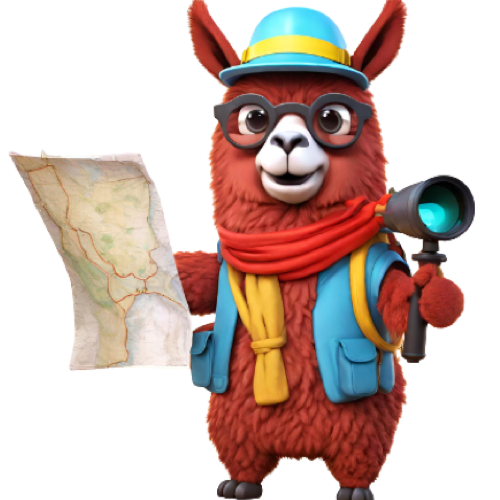: Grounded Large Vision-Language Model for Remote Sensing [CVPR-2024]
<p align="center">
    
</p>

#### [Kartik Kuckreja](https://www.linkedin.com/in/kartik-kuckreja-930531221/)\*, [Muhammad Sohail Danish](https://www.linkedin.com/in/muhammad-sohail-danish/)\*, [Muzammal Naseer](https://muzammal-naseer.com/), [Abhijit Das](https://sites.google.com/site/dasabhijit2048/home), [Salman Khan](https://salman-h-khan.github.io/) and [Fahad Khan](https://sites.google.com/view/fahadkhans/home)
\* Equally contributing first authors

#### **Mohamed bin Zayed University of AI, Birla Institute of Technology & Science, Australian National University, Linkoping University**

[](https://mbzuai-oryx.github.io/GeoChat)
[](https://arxiv.org/abs/2311.15826)
[](https://youtu.be/KOKtkkKpNDk)

---

## 📢 Latest Updates
- Supplementary material for the accepted paper is available here: [Supplementary](https://github.com/mbzuai-oryx/GeoChat/blob/main/docs/geochat_supp.pdf).
- **Feb-28-24**: We open source the code, model, dataset, and evaluation scripts. 
- **Feb-27-24**: GeoChat has been accepted to **CVPR-24** 🎉. 
- **Nov-28-23**: GeoChat paper is released [arxiv link](https://arxiv.org/abs/2311.15826). 🔥🔥
---


## Overview

GeoChat is the first grounded Large Vision Language Model, specifically tailored to Remote Sensing(RS) scenarios. Unlike general-domain models, GeoChat excels in handling high-resolution RS imagery, employing region-level reasoning for comprehensive scene interpretation. Leveraging a newly created RS multimodal dataset, GeoChat is fine-tuned using the LLaVA-1.5 architecture. This results in robust zero-shot performance across various RS tasks, including image and region captioning, visual question answering, scene classification, visually grounded conversations, and referring object detection.

---
## Contents
- [Install](#install)
- [Model Zoo](https://github.com/mbzuai-oryx/GeoChat/blob/main/docs/MODEL_ZOO.md)
- [Dataset](https://huggingface.co/datasets/MBZUAI/GeoChat_Instruct/blob/main/GeoChat_Instruct.json)
- [Train](#train)
- [Evaluation](#evaluation)

## Install

1. Clone this repository and navigate to GeoChat folder
```bash
git clone https://github.com/mbzuai-oryx/GeoChat.git
cd GeoChat
```

2. Install Package
```Shell
conda create -n geochat python=3.10 -y
conda activate geochat
pip install --upgrade pip  # enable PEP 660 support
pip install -e .
```

3. Install additional packages for training cases
```
pip install ninja
pip install flash-attn --no-build-isolation
```

### Upgrade to latest code base

```Shell
git pull
pip uninstall transformers
pip install -e .
```

## GeoChat Weights and Demo
Please check out our [Model Zoo](https://github.com/mbzuai-oryx/GeoChat/blob/main/docs/MODEL_ZOO.md) for all public GeoChat checkpoints, and check [LoRA.md](https://github.com/mbzuai-oryx/GeoChat/blob/main/docs/LoRA.md) for instructions on how to run the demo and training.

## Train

GeoChat training consists of visual instruction tuning using GeoChat_Instruct Dataset: 318k Vicuna-generated multimodal instruction-following data, finetuned over the pretrained weights of LlaVA-v1.5.

We train GeoChat on 3 A100 GPUs with 40GB memory. To train on fewer GPUs, you can reduce the `per_device_train_batch_size` and increase the `gradient_accumulation_steps` accordingly. Always keep the global batch size the same: `per_device_train_batch_size` x `gradient_accumulation_steps` x `num_gpus`.

### Hyperparameters
We use a similar set of hyperparameters as Vicuna in finetuning.  Both hyperparameters used in pretraining and finetuning are provided below.

| Hyperparameter | Global Batch Size | Learning rate | Epochs | Max length | Weight decay |
| --- | ---: | ---: | ---: | ---: | ---: |
| GeoChat-7B | 144 | 2e-5 | 1 | 2048 | 0 |

### Pretrain (feature alignment)

We use the pretrained projector from LLaVAv1.5, which is trained on 558K subset of the LAION-CC-SBU dataset with BLIP captions. It takes around 3.5 hours for LLaVA-v1.5-7B.

- `--mm_projector_type mlp2x_gelu`: the two-layer MLP vision-language connector.
- `--vision_tower openai/clip-vit-large-patch14-336`: CLIP ViT-L/14 336px.

### Visual Instruction Tuning

1. Prepare data

Please download the annotation of the final mixture of our instruction tuning data [GeoChat_Instruct.json](https://huggingface.co/datasets/MBZUAI/GeoChat_Instruct/blob/main/GeoChat_Instruct.json), and download the split image zips from the [hugging face](https://huggingface.co/datasets/MBZUAI/GeoChat_Instruct). Save the multiple image zips in a single folder and run the following command to merge them:
```Shell
cat images_parta* > images.zip
```
Unzip the images.zip file to a folder and give the folder's path in [finetune_lora.sh](https://github.com/mbzuai-oryx/GeoChat/blob/main/scripts/finetune_lora.sh).

2. Start training!

Visual instruction tuning takes more time due to the increased resolution of CLIP to 504X504. It takes around ~25 hours to finetune GeoChat-7B on 3x A100 (40G).

Training script with DeepSpeed ZeRO-3: [`finetune_lora.sh`](https://github.com/mbzuai-oryx/GeoChat/blob/main/scripts/finetune_lora.sh).

Options to note:

- `--mm_projector_type mlp2x_gelu`: the two-layer MLP vision-language connector.
- `--vision_tower openai/clip-vit-large-patch14-336`: CLIP ViT-L/14 336px.
- `--image_aspect_ratio pad`: this pads the non-square images to square, instead of cropping them; it slightly reduces hallucination.
- `--group_by_modality_length True`: this should only be used when your instruction tuning dataset contains both language (e.g. ShareGPT) and multimodal (e.g. LLaVA-Instruct).
- 
## Evaluation

We evaluate GeoChat on a diverse set of 7 benchmarks. To ensure the reproducibility, we evaluate the models with greedy decoding. We do not evaluate using beam search to make the inference process consistent with the chat demo of real-time outputs.
See [Evaluation.md](https://github.com/mbzuai-oryx/GeoChat/blob/main/docs/Evaluation.md).

## 🏆 Contributions

- **RS multimodal instruction following dataset.** We present a novel data generation pipeline, to leverage existing object detection dataset to create short descriptions of the images, followed by using Vicuna-v1.5 to create conversations using the generated text alone. Further, we add visual question-answering and scene classification abilities 
 using their corresponding datasets. This results in a total of 318k instruction pairs for RS domain.
- **GeoChat.** Leveraging our dataset, we finetune LLaVA-1.5 to create the remote sensing-domain vision-language model - GeoChat. Our LoRA fine-tuning is efficient and avoids forgetting the necessary context embedded in fully-tuned LLaVA model, whose MLP projection is trained to align images into the word embedding space of the LLM (Vicuna-v1.5). This allows GeoChat to retain the conversation and instruction following abilities of LLaVA and extend its domain-knowledge to remote sensing tasks.  

- **Evaluation Benchmark.** We also address the lack of evaluation benchmarks to assess the capability of existing VLMs on remote-sensing conversations. To this end, we setup evaluation protocols for conversation grounding in RS, as well as a setup a suite of tasks to allow comparisons with future efforts in this direction. We show various supervised as well as  zero-shot evaluations for different remote sensing tasks, including image captioning, visual question answering and scene classification to demonstrate the generalisability of GeoChat conversational VLM.

---
## 👁️💬 GeoChat : Grounded Large Vision-Language Model for Remote Sensing

GeoChat can accomplish multiple tasks for remote-sensing (RS) image comprehension in a unified framework. Given suitable task tokens and user queries, the model can generate visually grounded responses (text with corresponding object locations - shown on top), visual question answering on images and regions (top left and bottom right, respectively) as well as scene classification (top right) and normal natural language conversations (bottom). This makes it the first RS VLM with grounding capability. 

<p align="center">
  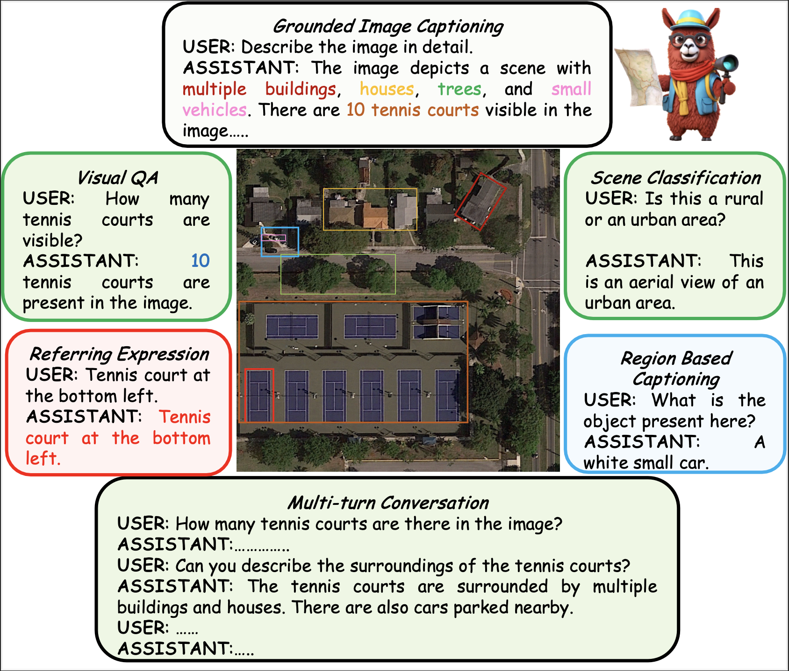
</p>

---

## 🛰️ GeoChat : Architecture

An overview of GeoChat - the first grounded large vision-language model for remote sensing. Given an image input together with a user query, a visual backbone is first used to encode patch-level tokens at a higher resolution via interpolating positional encodings. A multi-layer perceptron (MLP) is used to adapt vision-tokens to language space suitable for input to a Large Language Model (Vicuna 1.5). Besides visual inputs, region locations can also be input to the model together with task-specific prompts that specify the desired task required by the user. Given this context, the LLM can generate natural language responses interleaved with corresponding object locations. GeoChat can perform multiple tasks as shown on top e.g., scene classification, image/region captioning, VQA and grounded conversations.

<p align="center">
  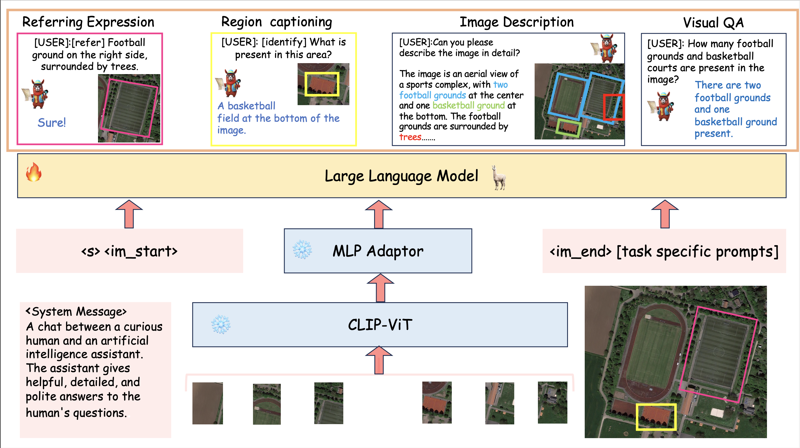
</p>

---

## 🔍 RS Multimodal Instruction Dataset

Types of annotations available in the GeoChat instruction-set. For a given RS image, we obtain object attribute and relationship information, referring expressions and region captions along with their corresponding region annotations (shown over the image). This structured information is used to create the rich instruction-set with a total of 318k image-instruction pairs.

<p align="center">
  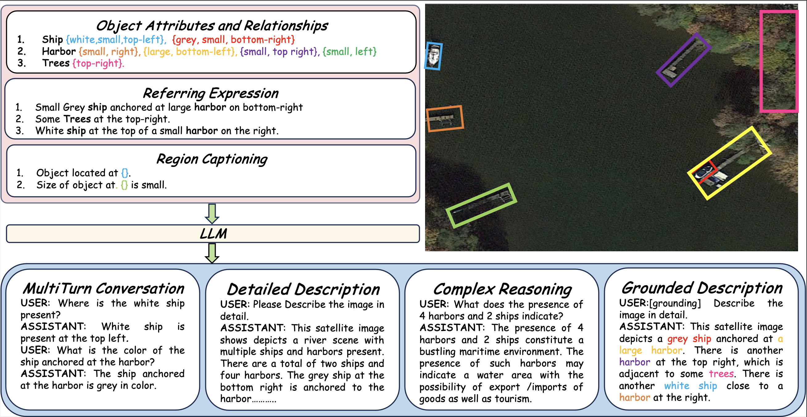
</p>


## 🤖 Qualitative results of GeoChat

Qualitative results of GeoChat. (<em>left-right</em>) Results are shown on grounding, referring object detection, and disaster/damage detection. The user can provide task-specific tokens (e.g., <strong>[grounding]</strong>) to shape model responses according to the desired behavior. The model can generate textual responses (<em>right</em>), only visual grounding (<em>center</em>) and both text and object groundings interleaved together (<em>left</em>). The model can also specify object types, object counts, object attributes and object relationships.
<p align="center">
  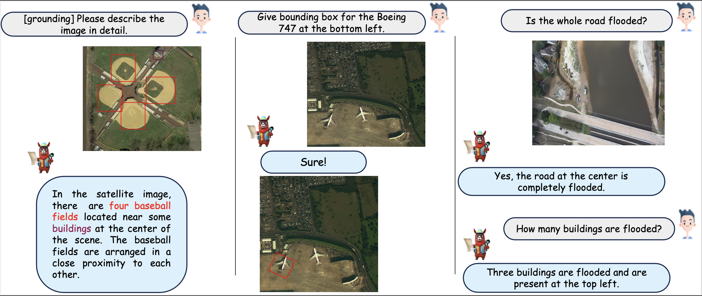
</p>

---

## 🤖 Visual Question Answering
Qualitative examples for Visual Question Answering tasks. GeoChat is able to hold multi-turn conversations, based on various types of questions, including presence, count, complex comparisons and so on. It is able to detect objects and hold conversations against low resolution images as well.
<p align="center">
  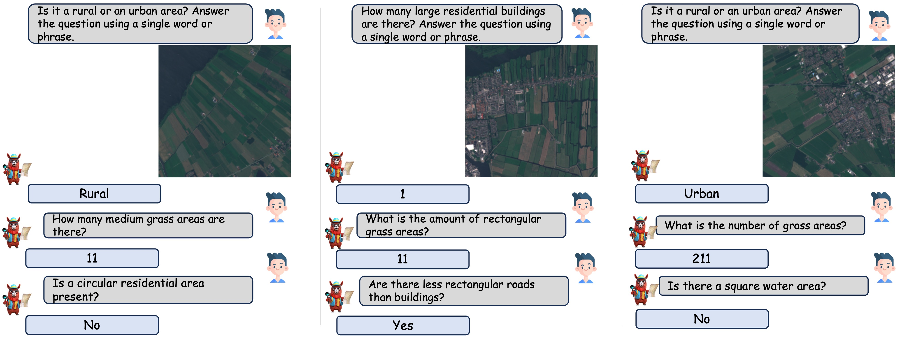
</p>

---

## 🤖 Scene Classification
Qualitative examples for scene classification. We give the model all the classes from the dataset and ask to choose only one.
<p align="center">
  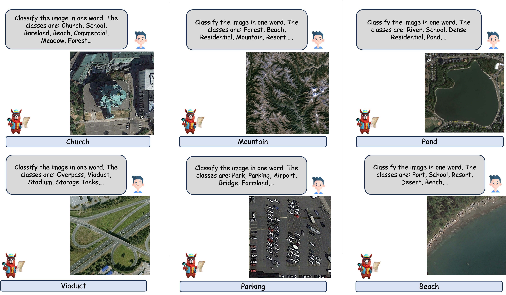
</p>

---

## 🤖 Grounded Description
When asked to describe the image with the special token '[grounding]', GeoChat outputs both the description of the image as well as the bounding boxes for all the objects detected.
<p align="center">
  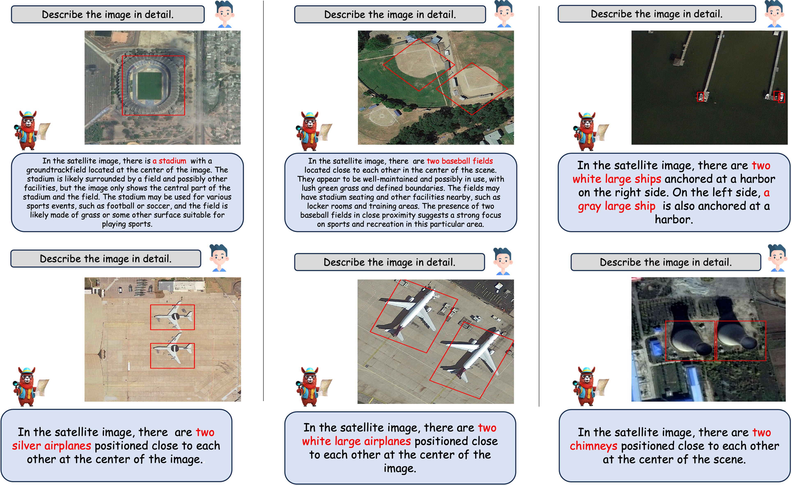
</p>

---

## 🤖 Referring Expression
When asked about an object as a referred expression, GeoChat is able to locate it and draw rotated bounding boxes around it correspondingly.
<p align="center">
  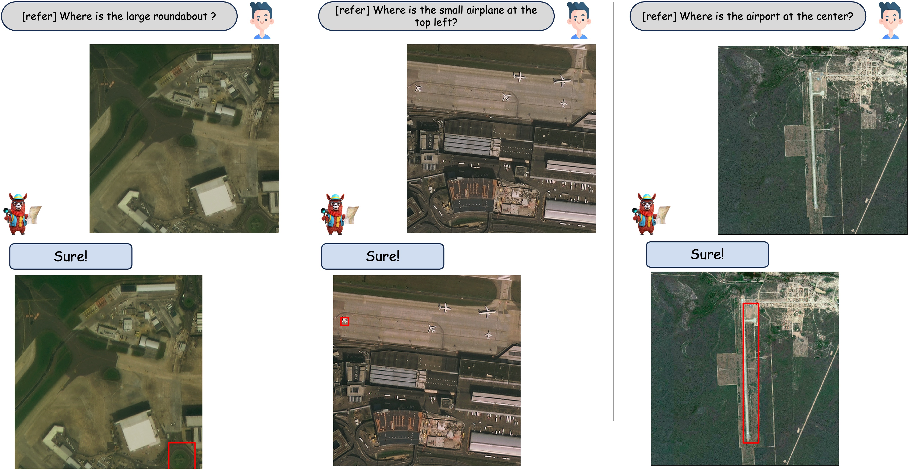
</p>
<p align="center">
  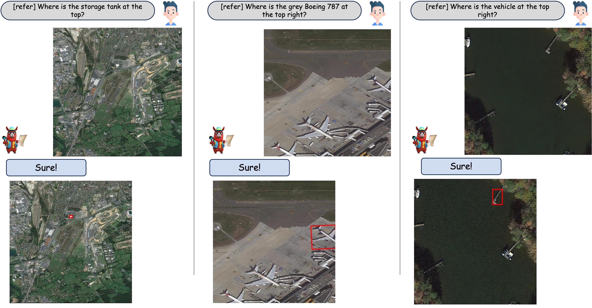
</p>

---

## 🤖 Region Caption
Qualitative examples for region-based captioning. Given a bounding box, GeoChat is able to provide brief descriptions about the area or the object covered by the bounding box.
<p align="center">
  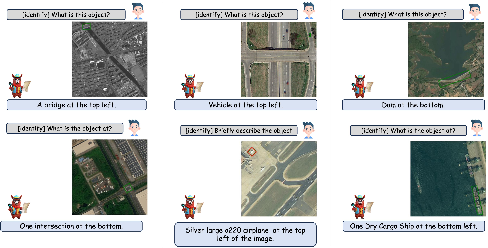
</p>

---

## 📜 Citation
```bibtex
  @article{kuckreja2023geochat,
          title={GeoChat: Grounded Large Vision-Language Model for Remote Sensing},
          author={Kuckreja, Kartik and Danish, Muhammad S. and Naseer, Muzammal and Das, Abhijit and Khan, Salman and Khan, Fahad S.},
          journal={The IEEE/CVF Conference on Computer Vision and Pattern Recognition},
          year={2024}
  }
```
## 🙏 Acknowledgement
We are thankful to LLaVA and Vicuna for releasing their models and code as open-source contributions.

---
[](https://www.ival-mbzuai.com)
[](https://github.com/mbzuai-oryx)
[](https://mbzuai.ac.ae)
