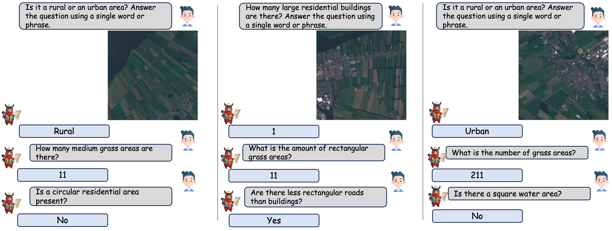

# GeoChat : Grounded Large Vision-Language Model for Remote Sensing
<p align="center">
    
</p>

#### [Kartik Kuckreja]()\*, [Muhammad Sohail Danish]()\*, [Muzammal Naseer](), [Abhijit Das](), [Salman Khan](https://salman-h-khan.github.io/) and [Fahad Khan](https://sites.google.com/view/fahadkhans/home)
\* Equally contributing first authors

#### **Mohamed bin Zayed University of AI, Birla Institute of Technology & Science, Australian National University, Linkoping University**

[](https://arxiv.org/abs/2311.15826)

---

## 📢 Latest Updates
- **Nov-28-23**: GeoChat paper is released [arxiv link](https://arxiv.org/abs/2311.15826). 🔥🔥
- 📦 Code, models, and datasets coming soon! 🚀
---

## Abstract

Recent advancements in Large Vision-Language Models (VLMs) have shown great promise in natural image domains, allowing users to hold a dialogue about given visual content. 
However, such general-domain VLMs perform poorly for Remote Sensing (RS) scenarios, leading to inaccurate or fabricated information when presented with RS domain-specific queries. 
Such a behavior emerges due to the unique challenges introduced by RS imagery. For example, to handle high-resolution RS imagery with diverse scale changes across categories and many small objects, region-level reasoning is necessary alongside holistic scene interpretation. Furthermore, the lack of domain-specific multimodal instruction following data as well as strong backbone models for RS make it hard for the models to align their behavior with user queries. To address these limitations, we propose GeoChat - the first versatile remote sensing VLM that offers multitask conversational capabilities with high-resolution RS images. Specifically, GeoChat can not only answer image-level queries but also accepts region inputs to hold region-specific dialogue. Furthermore, it can visually ground objects in its responses by referring to their spatial coordinates. To address the lack of domain-specific datasets, we generate a novel RS multimodal instruction-following dataset by extending image-text pairs from existing diverse RS datasets.
Leveraging this rich dataset, we fine-tune our remote sensing VLM based on the LLaVA-1.5 architecture. 
We establish a comprehensive benchmark for RS multitask conversations and compare with a number of baseline methods. GeoChat demonstrates robust zero-shot performance on various remote sensing tasks, e.g., image and region captioning, visual question answering, scene classification, visually grounded conversations and referring object detection. Our codes will be open-sourced.

---

## 🏆 Contributions

- **RS multimodal instruction following dataset.** We present a novel data generation pipeline, to leverage existing object detection dataset to create short descriptions of the images, followed by using Vicuna-v1.5 to create conversations using the generated text alone. Further, we add visual question-answering and scene classification abilities 
 using their corresponding datasets. This results in a total of 318k instruction pairs for RS domain.
- **GeoChat.** Leveraging our dataset, we finetune LLaVA-1.5 to create the remote sensing-domain vision-language model - GeoChat. Our LoRA fine-tuning is efficient and avoids forgetting the necessary context embedded in fully-tuned LLaVA model, whose MLP projection is trained to align images into the word embedding space of the LLM (Vicuna-v1.5). This allows GeoChat to retain the conversation and instruction following abilities of LLaVA and extend its domain-knowledge to remote sensing tasks.  

- **Evaluation Benchmark.** We also address the lack of evaluation benchmarks to assess the capability of existing VLMs on remote-sensing conversations. To this end, we setup evaluation protocols for conversation grounding in RS, as well as a setup a suite of tasks to allow comparisons with future efforts in this direction. We show various supervised as well as  zero-shot evaluations for different remote sensing tasks, including image captioning, visual question answering and scene classification to demonstrate the generalisability of GeoChat conversational VLM.

---
## 👁️💬 GeoChat : Grounded Large Vision-Language Model for Remote Sensing

GeoChat can accomplish multiple tasks for remote-sensing (RS) image comprehension in a unified framework. Given suitable task tokens and user queries, the model can generate visually grounded responses (text with corresponding object locations - shown on top), visual question answering on images and regions (top left and bottom right, respectively) as well as scene classification (top right) and normal natural language conversations (bottom). This makes it the first RS VLM with grounding capability. 

<p align="center">
  
</p>

---

## 👁️💬 GeoChat : Architecture

An overview of GeoChat - the first grounded large vision-language model for remote sensing. Given an image input together with a user query, a visual backbone is first used to encode patch-level tokens at a higher resolution via interpolating positional encodings. A multi-layer perceptron (MLP) is used to adapt vision-tokens to language space suitable for input to a Large Language Model (Vicuna 1.5). Besides visual inputs, region locations can also be input to the model together with task-specific prompts that specify the desired task required by the user. Given this context, the LLM can generate natural language responses interleaved with corresponding object locations. GeoChat can perform multiple tasks as shown on top e.g., scene classification, image/region captioning, VQA and grounded conversations.

<p align="center">
  
</p>

---

## 🔍 RS Multimodal Instruction Dataset

Types of annotations available in the GeoChat instruction-set. For a given RS image, we obtain object attribute and relationship information, referring expressions and region captions along with their corresponding region annotations (shown over the image). This structured information is used to create the rich instruction-set with a total of 318k image-instruction pairs.

<p align="center">
  
</p>


## 🤖 Qualitative results of GeoChat

Qualitative results of GeoChat. (<em>left-right</em>) Results are shown on grounding, referring object detection, and disaster/damage detection. The user can provide task-specific tokens (e.g., <strong>[grounding]</strong>) to shape model responses according to the desired behavior. The model can generate textual responses (<em>right</em>), only visual grounding (<em>center</em>) and both text and object groundings interleaved together (<em>left</em>). The model can also specify object types, object counts, object attributes and object relationships.
<p align="center">
  
</p>

---

## 🤖 Visual Question Answering

<p align="center">
  
</p>

---

## 🤖 Scene Classification

<p align="center">
  
</p>

---

## 🤖 Grounded Description

<p align="center">
  
</p>

---

## 🤖 Referring Expression

<p align="center">
  
</p>
<p align="center">
  
</p>

---

## 🤖 Region Caption

<p align="center">
  
</p>

---

## 📜 Citation
```bibtex
@misc{kuckreja2023geochat,
      title={GeoChat: Grounded Large Vision-Language Model for Remote Sensing}, 
      author={Kartik Kuckreja and Muhammad Sohail Danish and Muzammal Naseer and Abhijit Das and Salman Khan and Fahad Shahbaz Khan},
      year={2023},
      eprint={2311.15826},
      archivePrefix={arXiv},
      primaryClass={cs.CV}
}  
```

---
[](https://www.ival-mbzuai.com)
[](https://github.com/mbzuai-oryx)
[](https://mbzuai.ac.ae)
